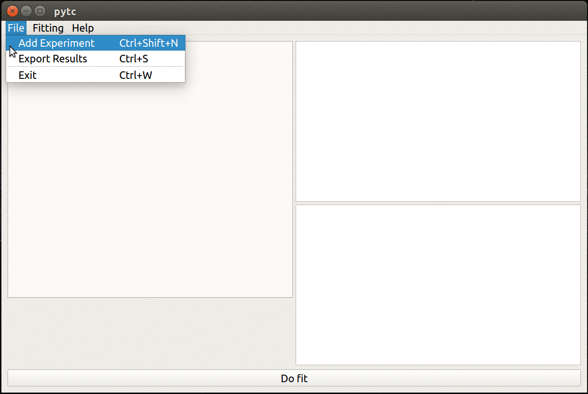

====
pytc
====
Open source python software for analyzing Isothermal Titration Calorimetry data.

`Duvvuri H, Wheeler LC, Harms MJ. (2018) "pytc: Open-Source Python Software for Global Analyses of Isothermal Titration Calorimetry Data" Biochemistry. doi://10.1021/acs.biochem.7b01264 <https://pubs.acs.org/doi/abs/10.1021/acs.biochem.7b01264>`_

Download
========

`Windows GUI <https://github.com/harmslab/pytc-gui/releases/download/1.2.2/pytc-gui_v1.2.2_setup.exe>`_ | `Mac GUI <https://github.com/harmslab/pytc-gui/releases/download/1.2.2/pytc-gui_v1.2.2.dmg>`_ | `Linux GUI <https://pytc-gui.readthedocs.io/en/latest/installation.html>`_ | `API <installation.html>`_

Introduction
============
`pytc <https://github.com/harmslab/pytc>`_ is python software used to extract
thermodynamic information from isothermal titration calorimetry (ITC)
experiments.  It fits arbitrarily complex thermodynamic models to multiple ITC
experiments simultaneously.  We built it with four design principles:

 + **Open source and cross platform**. The full source code should be available.
   The program should not require proprietary software to run.
 + **Rigorous**. Program should use best practices and current algorithms for
   performing fits and assessing fit quality.
 + **Ease of use**. Fitting basic models should be easy.  Implementing completely
   new thermodynamic models should be straightforward.
 + **Accessible for users and programmers**.  It should have both a GUI and a
   well-documented API.

Features
========

 + Simple, cross-platform GUI based on `PyQt5 <https://riverbankcomputing.com/software/pyqt/intro>`_
 + Clean, pythonic API
 + New models can be defined using a few lines of python code
 + Easy integration with `jupyter <https://jupyter.org/>`_ notebooks for
   writing custom fitting scripts

Documentation
=============

 + `Installation <installation.html>`_
 + `Fitting models with the GUI <https://pytc-gui.readthedocs.io/en/latest/how_to_img.html>`_
 + `Fitting models using the API <https://github.com/harmslab/pytc-demos/>`_
 + `Fit statistics <statistics.html>`_
 + `Fit strategies <fitters.html>`_
 + `Individual experiment models included in package <indiv_models.html>`_
 + `Global fit models included in package <global_models.html>`_
 + `Defining new models <writing_new_models.html>`_

.. warning::
    **pytc** will fit all sorts of complicated models to your data. It is up to
    you to make sure the fit is justified by the data.  See the
    `Fitting and statistics <statistics.html>`_ section to see what **pytc**
    reports to help in this decision making.

GUI
===

An animated gif showing the GUI in action.

API
===

Fit a single-site binding model to a :math:`Ca^{2+}/EDTA` binding experiment.

.. code:: python

    import pytc

    # Load in integrated heats from an ITC experiment
    e = pytc.ITCExperiment("demos/ca-edta/tris-01.DH",
                           pytc.indiv_models.SingleSite)

    # Create the global fitter, add the experiment
    g = pytc.GlobalFit()
    g.add_experiment(e)

    # Do the fit
    g.fit()

    # Print the results out
    g.plot()
    print(g.fit_as_csv)

.. toctree::
   :maxdepth: 2
   :caption: Contents:

   _api/pytc.rst

Implementation
==============
   Our implementation is built on `python3 <https://www.python.org/>`_ extended with  `numpy <http://www.numpy.org/>`_,
   `scipy <https://www.scipy.org/>`_, `matplotlib <http://matplotlib.org/>`_ and
   `emcee <http://dan.iel.fm/emcee/current/>`_.  The GUI is built on
   `pytq5 <http://pyqt.sourceforge.net/Docs/PyQt5/installation.html>`_.

Indices and tables
==================

* :ref:`genindex`
* :ref:`modindex`
* :ref:`search`
