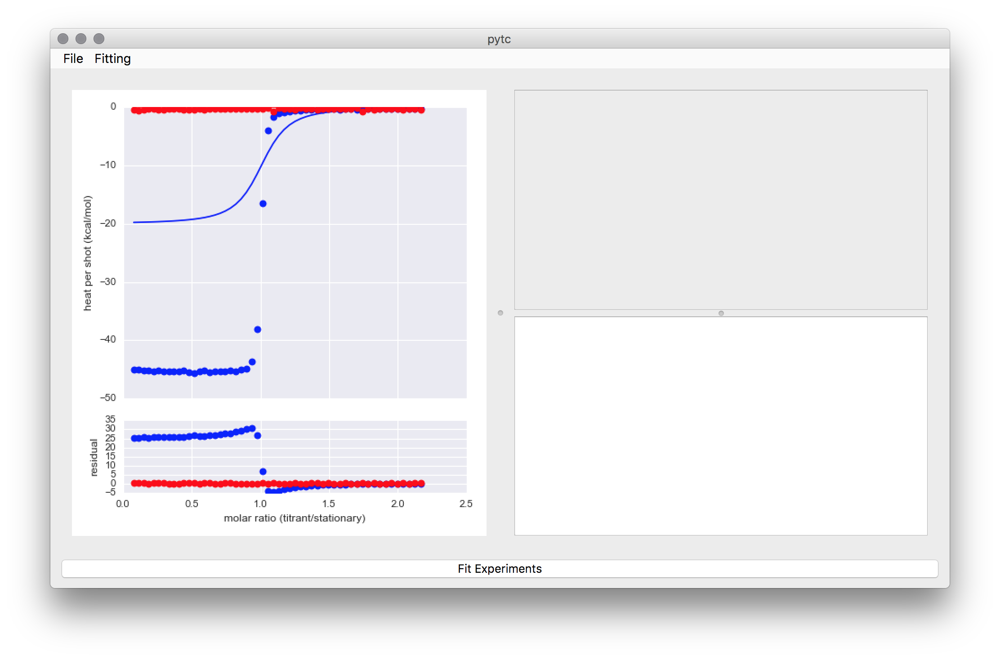
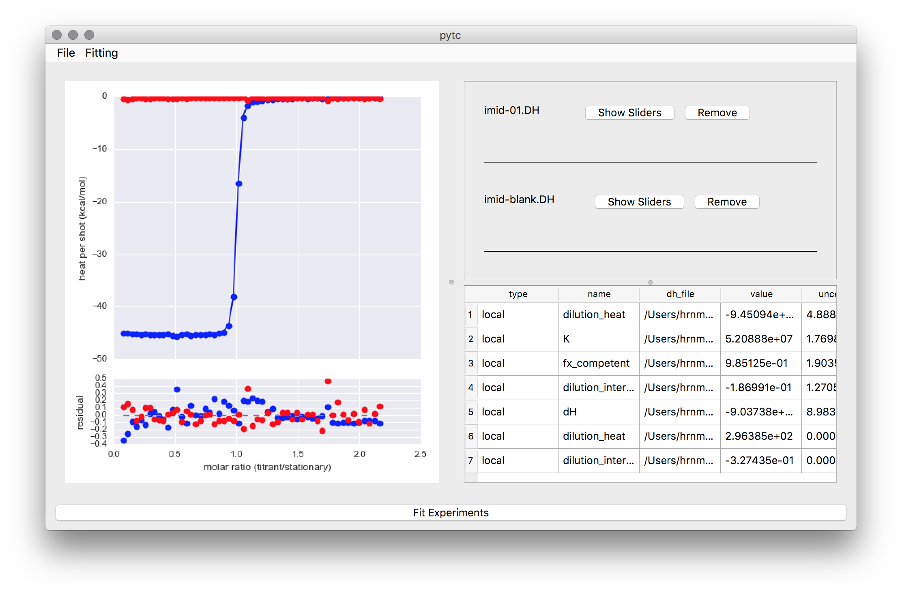

====
pytc
====
A python software package for analyzing Isothermal Titration Calorimetry data.
The name is a `portmanteau <https://xkcd.com/739/>`_ of Python and ITC.  

Introduction
============
`pytc <https://github.com/harmslab/pytc>`_ is python software used to extract
thermodynamic information from isothermal titration calorimetry (ITC)
experiments.  It fits arbitrarily complex thermodynamic models to multiple ITC
experiments simultaneously.  We built it with three design principles:

 + **Open source and cross platform**. The full source code should be available.
   The program should not require proprietary software to run. 
 + **Ease of use**. Fitting basic models should be easy.  Implementing completely
   new thermodynamic models should be straightforward. 
 + **Accessible for users and programmers**.  It should have both a GUI and a 
   well-documented API. 

Our implementation is built on `python3 <https://www.python.org/>`_ extended with  `numpy <http://www.numpy.org/>`_,
`scipy <https://www.scipy.org/>`_, `matplotlib <http://matplotlib.org/>`_ and
`emcee <http://dan.iel.fm/emcee/current/>`_.  The GUI is built on
`pytq5 <http://pyqt.sourceforge.net/Docs/PyQt5/installation.html>`_.

Features
========

 + Clean, pythonic API
 + Simple, cross-platform GUI based on `PyQt5 <https://riverbankcomputing.com/software/pyqt/intro>`_.
 + New models can be defined using a few lines of python code.
 + Easy integration with `jupyter <https://jupyter.org/>`_ notebooks for 
   writing custom fitting scripts.

Documentation
=============

 + `Installation <installation.html>`_
 + `Fitting models using the API <https://github.com/harmslab/pytc-demos/>`_.
 + `Fitting models using the GUI <https://pytc-gui.readthedocs.io/en/latest/>`_.
 + `Fitting and statistics <statistics.html>`_.
 + `Description of individual experiment models included in package <indiv_models.html>`_.
 + `Description of global fits included in package <global_models.html>`_.
 + `Defining new models <writing_new_models.html>`_.

.. warning::
    **pytc** will fit all sorts of complicated models to your data. It is up to
    you to make sure the fit is justified by the data.  See the 
    `Fitting and statistics <statistics.html>`_ section to see what **pytc** 
    reports to help in this decision making.

API Quick Start
===============

If you already have a python3-based scientific computing environment installed, 
you can start using the API by:

.. sourcecode:: bash

    # Install pytc
    pip3 install pytc-fitter

    # Clone the demos repo
    git clone https://github.com/harmslab/pytc-demos

    # Fire up jupyter 
    cd pytc-demos
    jupyter notebook

Example code using the API
==========================

Fit a :math:`Ca^{2+}/EDTA` binding experiment to a single-site binding model.

.. sourcecode:: python

    import pytc

    # Load in integrated heats from an ITC experiment
    e = pytc.ITCExperiment("demos/ca-edta/tris-01.DH",
                           pytc.indiv_models.SingleSite)

    # Create the global fitter, add the experiment, and fit
    g = pytc.GlobalFit()
    g.add_experiment(e)
    g.fit()

    # Print the results out
    g.plot()
    print(g.fit_as_csv)

GUI
===

The GUI is installed separately from the API. Instructions are 
`here <https://pytc-gui.readthedocs.io/en/latest/installation.html>`_.  The GUI
docs are `here <https://pytc-gui.readthedocs.io/en/latest/>`_.  A few 
screenshots showing the GUI in action are below.

.. toctree::
   :maxdepth: 2
   :caption: Contents:

   _api/pytc.rst

Indices and tables
==================

* :ref:`genindex`
* :ref:`modindex`
* :ref:`search`
