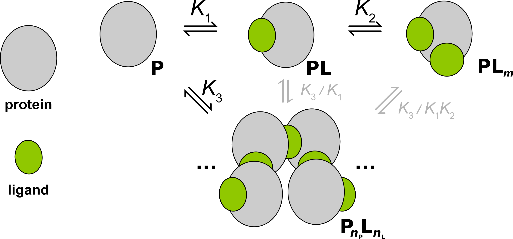

:orphan:

Assembly Auto Inhibition
------------------------
+ Ligand binding that promotes protein oligomerization, which is auto-inhibited by saturation of ligand (related to the prozone effect).
+ Model contributed by: Martin Rennie, PhD
+ Rennie & Crowley (2019). *ChemPhysChem* `(link) <https://onlinelibrary.wiley.com/doi/10.1002/cphc.201900153>`_.
+ `indiv_models\.AssemblyAutoInhibition <https://github.com/harmslab/pytc/blob/master/pytc/indiv_models/assembly_auto_inhibition.py>`_

Scheme
~~~~~~

Illustrated with :math:`m=2`, :math:`n_L=5`, :math:`n_P=4`. 

Parameters
~~~~~~~~~~
+--------------------------------+------------------------+----------------------------+---------------+
|parameter                       | variable               | parameter name             | class         |
+================================+========================+============================+===============+
|macroscopic association constant|                        |                            |               |
|for binding of the first ligand |                        |                            |               |
|to the protein monomer          |                        |                            |               |
|(M\ :sup:`-1`)                  | :math:`K_{1}`          | :code:`Klig1`              | thermodynamic |
+--------------------------------+------------------------+----------------------------+---------------+
|average* association constant   |                        |                            |               |
|for binding of the remaining    |                        |                            |               |
|ligands to the protein monomer  |                        |                            |               |
|(M\ :sup:`-1`)                  | :math:`K_{2}`          | :code:`Klig2`              | thermodynamic |
+--------------------------------+------------------------+----------------------------+---------------+
|average* association constant   |                        |                            |               |
|for formation of the protein    |                        |                            |               |
|oligomer (M\ :sup:`-1`)         | :math:`K_{3}`          | :code:`Kolig`              | thermodynamic |
+--------------------------------+------------------------+----------------------------+---------------+
|enthalpy change for             |                        |                            |               |
|binding of the first ligand to  |                        |                            |               |
|the protein monomer             | :math:`\Delta H_{1}`   | :code:`dHlig1`             | thermodynamic |
+--------------------------------+------------------------+----------------------------+---------------+
|enthalpy change for             |                        |                            |               |
|binding of the remaining ligands|                        |                            |               |
|to the protein monomer          | :math:`\Delta H_{2}`   | :code:`dHlig2`             | thermodynamic |
+--------------------------------+------------------------+----------------------------+---------------+
|enthalpy change for formation   |                        |                            |               |
|of the protein oligomer         |                        |                            |               |
|                                | :math:`\Delta H_{3}`   | :code:`dHolig`             | thermodynamic |
+--------------------------------+------------------------+----------------------------+---------------+
|stoichiometry of ligands in     | :math:`m`              | :code:`m`                  | thermodynamic |
|the saturated protein monomer,  |                        |                            |               |
|must be ≥2                      |                        |                            |               |
+--------------------------------+------------------------+----------------------------+---------------+
|stoichiometry of ligands in     | :math:`n_{L}`          | :code:`n_lig`              | thermodynamic |
|the protein oligomer            |                        |                            |               |
+--------------------------------+------------------------+----------------------------+---------------+
|stoichiometry of proteins in    | :math:`n_{P}`          | :code:`n_prot`             | thermodynamic |
|the protein oligomer            |                        |                            |               |
+--------------------------------+------------------------+----------------------------+---------------+
|fraction competent protein      | ---                    | :code:`fx_prot_competent`  | nuisance      |
+--------------------------------+------------------------+----------------------------+---------------+
|fraction competent ligand       | ---                    | :code:`fx_lig_competent`   | nuisance      |
+--------------------------------+------------------------+----------------------------+---------------+
|slope of heat of dilution       | ---                    | :code:`dilution_heat`      | nuisance      |
+--------------------------------+------------------------+----------------------------+---------------+
|intercept of heat of dilution   | ---                    | :code:`dilution_intercept` | nuisance      |
+--------------------------------+------------------------+----------------------------+---------------+
\*equilibrium constants for the higher order equilibria are "averaged" using :math:`\sqrt[N]{K}`,
where :math:`N` is the order of the equilibrium, such that the units are M\ :sup:`-1`
(see Rennie & Crowley (2019). *ChemPhysChem* `(link) <https://onlinelibrary.wiley.com/doi/10.1002/cphc.201900153>`_)

Species
~~~~~~~

.. math::
    [P_{T}]_{i} =   [P]_{i} + [PL]_{i} + [PL_{m}]_{i} + n_{P}[P_{olig}]_{i}

.. math::
    [L_{T}]_{i} = [L]_{i} + [PL]_{i} + m[PL_{m}]_{i} + n_{L}[P_{olig}]_{i}

.. math::
    [PL]_{i} = K_{1}[P]_{i}[L]_{i}

.. math::
    [PL_{2}]_{i} = K_{1}K_{2}^{m-1}[P]_{i}[L]_{i}^{m}

.. math::
    [P_{olig}]_{i} = K_{3}^{n_{L}+n_{P}-1}[P]_{i}^{n_{P}}[L]_{i}^{n_{L}}

Heat
~~~~

.. math::
    q_{i} = V_{cell}\Big ( \Delta H_{1}^{\circ}([PL]_{i} - [PL]_{i-1}(1-v_{i}/V_{cell})) \\
                          + (\Delta H_{1}^{\circ} + \Delta H_{2}^{\circ})([PL_{2}]_{i} - [PL_{2}]_{i-1}(1 - v_{i}/V_{cell})) \\
                          +  \Delta H_{3}^{\circ}([P_{olig}]_{i} - [P_{olig}]_{i-1}(1 - v_{i}/V_{cell})) \Big ) + q_{dil}

where: :math:`[P_{T}]_{i}` is the total cell concentration of protein at the :math:`i^\text{th}` injection (independent variable);
:math:`[L_{T}]_{i}` is the total cell concentration of ligand at the :math:`i^\text{th}` injection (independent variable);
:math:`V_{cell}` is the volume of the cell;
:math:`v_{i}` is the volume of the :math:`i^\text{th}` injection;
:math:`q_{i}` is the heat generated from the :math:`i^\text{th}` injection;
:math:`q_{dil}` is the heat of dilution.
