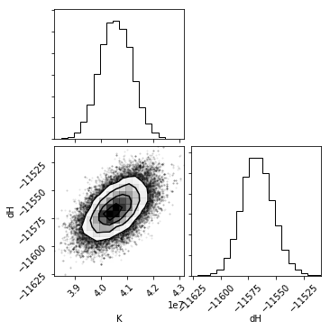

:orphan:

======================
Fitting and Statistics
======================

.. warning::
    pytc will fit all sorts of complicated models to your data. It is up to
    you to make sure the fit is justified by the data.  You should always 
    follow best practices for selecting the your model (choosing the simplest
    model, inspecting residuals, knowing the assumptions made, etc.)

Fits
====

**pytc** implements a variety of fitting strategies:

- BayesianFitter_ uses Markov-Chain Monte Carlo to estimate posterior
  probability distributions for all fit parameters. (Recommended)
- BootstrapFitter_ samples from uncertainty in each heat and then fits the model
  to pseudoreplicates using unweighted least-squares regression. 
- MLFitter_ fits the model to the data using least-squares regression
  weighted by the uncertainty in each heat. (Default)

Details on these strategies and their implementation below.  

Fit Results
===========

After you have peformed the fit, there are a variety of ways to access and 
assess your results.  These are available for all fit strategies.  

Parameter estimates as csv
--------------------------

.. sourcecode:: python

    g.fit_as_csv

where :code:`g` is a `GlobalFit <https://github.com/harmsm/pytc/blob/master/pytc/global_fit.py>`_ 
instance. This will print something like:

.. code::

    # Fit successful? True
    # 2017-05-13 09:27:25.177062
    # Fit type: maximum likelihood
    # AIC: -96.23759423779696
    # AICc: -93.8028116291013
    # BIC: -84.30368995841131
    # F: 292708.2585218862
    # Rsq: 0.9999672039142115
    # Rsq_adjusted: 0.9999637876552752
    # ln(L): 54.11879711889848
    # num_obs: 54
    # num_param: 5
    # p: 1.1102230246251565e-16
    type,name,exp_file,value,stdev,bot95,top95,fixed,guess,lower_bound,upper_bound
    local,dilution_heat,ca-edta/tris-01.DH,1.15715e+03,4.65377e+02,2.21447e+02,2.09285e+03,False,0.00000e+00,-inf,inf
    local,K,ca-edta/tris-01.DH,4.05476e+07,4.31258e+05,3.96805e+07,4.14147e+07,False,1.00000e+06,-inf,inf
    local,dilution_intercept,ca-edta/tris-01.DH,-6.12671e-01,6.71064e-02,-7.47597e-01,-4.77744e-01,False,0.00000e+00,-inf,inf
    local,dH,ca-edta/tris-01.DH,-1.15669e+04,1.00638e+01,-1.15872e+04,-1.15467e+04,False,-4.00000e+03,-inf,inf
    local,fx_competent,ca-edta/tris-01.DH,9.73948e-01,8.86443e-05,9.73770e-01,9.74126e-01,False,1.00000e+00,-inf,inf

Lines starting with "#" are statistics and fit meta data.  The statistical output
is described in the statistics_ section below.  Rendered as a table, the comma-
separated output has the following form:

===== ================== ================== ============ =========== ============ ============ ===== ============ =========== =========== 
type  name               exp_file           value        stdev       bot95        top95        fixed guess        lower_bound upper_bound 
===== ================== ================== ============ =========== ============ ============ ===== ============ =========== =========== 
local dilution_heat      ca-edta/tris-01.DH 1.15715e+03  4.65377e+02 2.21447e+02  2.09285e+03  False 0.00000e+00  -inf        inf         
local K                  ca-edta/tris-01.DH 4.05476e+07  4.31258e+05 3.96805e+07  4.14147e+07  False 1.00000e+06  -inf        inf         
local dilution_intercept ca-edta/tris-01.DH -6.12671e-01 6.71064e-02 -7.47597e-01 -4.77744e-01 False 0.00000e+00  -inf        inf         
local dH                 ca-edta/tris-01.DH -1.15669e+04 1.00638e+01 -1.15872e+04 -1.15467e+04 False -4.00000e+03 -inf        inf         
local fx_competent       ca-edta/tris-01.DH 9.73948e-01  8.86443e-05 9.73770e-01  9.74126e-01  False 1.00000e+00  -inf        inf         
===== ================== ================== ============ =========== ============ ============ ===== ============ =========== =========== 

- **type**: "local" or "global"
- **name**: parameter name 
- **exp_file**: name of experiment file
- **value**: estimate of the parameter
- **stdev**: standard deviation of parameter estimate
- **bot95/top95**: 95% confidence intervals of parameter estimate
- **fixed**: "True" or "False" depending on whether parameter was held to fixed value
- **guess**: parameter guess
- **lower_bound/upper_bound**: bounds set on the fit parameter during the fit

Fit and residuals plot
----------------------

.. sourcecode:: python

    g.plot()

where :code:`g` is a `GlobalFit <https://github.com/harmsm/pytc/blob/master/pytc/global_fit.py>`_ 
instance. This will create something like:

The fit residuals should be randomly distributed around zero, without systematic
deviations above or below.  Non-random residuals can indicate that the model
does not adequately describe the data, despite potentially having a small
residual standard error.  

Corner plots
------------

One powerful way to assess the fit results is through a *corner* plot, which
shows the confidence on each fit parameter, as well as covariation between 
each parameter.  The quality of the histograms is also an indication of whether
you have adequate sampling when using the bootstrap or bayesian methods. 

.. sourcecode:: python

    g.corner_plot()

where :code:`g` is a `GlobalFit <https://github.com/harmsm/pytc/blob/master/pytc/global_fit.py>`_ 
instance. This will create something like:

The diagonal shows a histogram for that parameter.  The bottom-left cells show
a 2D histogram of covariation between those parameters.

:code:`g.plot_corner` uses keywords to find and filter out nuisance parameters
like :code:`fx_competent` or :code:`dilution_heat`. To see these (or modify the
filtering) change the :code:`filter_params` list passed to the function.

.. _statistics:

Statistics
----------

.. sourcecode:: python

    g.fit_stats

where :code:`g` is a `GlobalFit <https://github.com/harmsm/pytc/blob/master/pytc/global_fit.py>`_ 
instance. This will return a dictionary of fit statistics with the following keys. 

- **AIC**: Akaike Information Criterion
- **AICc**: Akaike Information Criterion corrected for finite sample size
- **BIC**: Bayesian Information Criterion
- **df**: degrees of freedom
- **F**: The F test statistic
- **ln(L)**: log likelihood of the model
- **num_obs**: number of data points
- **num_param**: number of floating parameters fit
- **Rsq**: :math:`R^{2}`
- **Rsq_adjusted**: :math:`R^{2}_{adjusted}`
- **Fit type**: the type of fit (maxium likelihood, bootstrap, or bayesian)
- Keys like **"  bayesian: num_steps"** provide information specific to a given
  fit type. 

Model comparison
----------------

Models with more parameters will generally fit the data better than models with
fewer parameters.  These extra parameters may or may not be meaningful.  (You
could, for example, fit :math:`N` data points with :math:`N` parameters.  This
would give a perfect fit -- and very little insight into the system).  A
standard approach in model fittng is to choose the simplest model consistent
with the data.  A variety of statistics can be used to balance fitting the data 
well against the addition of many parameters.  **pytc** returns four test
statistics that penalize models based on the number of free parameters: Akaike
Information, corrected Akaike Information, Bayesian Information, and the
F-statistic. 

The :code:`pytc.util.compare_models` function will conveniently compare a
collection of models, weighting them by AIC, AICc, and BIC. 

Fitting Strategies
==================

pytc implements multiple fitting strategies including least-squares regression,
bootstrap sampling + least squares, and Bayesian MCMC.  These are implemented as 
subclasses of the `pytc.fitters.Fitter <https://github.com/harmslab/pytc/blob/master/pytc/fitters/base.py>`_.  
base class. 

.. _BayesianFitter:

Bayesian
--------

`pytc.fitters.BayesianFitter <https://github.com/harmslab/pytc/blob/master/pytc/fitters/bayesian.py>`_. 

Uses Markov-Chain Monte Carlo (MCMC) to sample from the posterior probability 
distributions of fit parameters. **pytc** uses the package `emcee <http://dan.iel.fm/emcee/current/>`_ to do the 
sampling.  The log likelihood function is:

.. math::

    ln(L) = -0.5 \sum_{i=0}^{i < N} \Big [ \frac{(dQ_{obs,i} - dQ_{calc,i}(\vec{\theta}))^{2}}{\sigma_{i}^{2}} + ln(\sigma_{i}^{2}) \Big ]

where :math:`dQ_{obs,i}` is an observed heat for a shot, :math:`dQ_{calc,i}` is
the heat calculated for that shot by the model, and :math:`\sigma_{i}` is the
experimental uncertainty on that heat.

The prior distribution is uniform within the specified parameter bounds.  If
any parameter is outside of its bounds, the prior is :math:`-\infty`.  
Otherwise, the prior is 0.0 (uniform). 

The posterior probability is given by the sum of the log prior and log 
likelihood functions.  

.. math::
    ln(P) = ln(L) + ln(prior)

Parameter estimates
~~~~~~~~~~~~~~~~~~~

Parameter estimates are the means of posterior probability distributions.

Parameter uncertainty
~~~~~~~~~~~~~~~~~~~~~

Parameter uncertainties are estimated by numerically integrating the posterior
probability distributions.

.. _BootstrapFitter:

Bootstrap
---------

`pytc.fitters.BootstrapFitter <https://github.com/harmslab/pytc/blob/master/pytc/fitters/bootstrap.py>`_. 

Samples from experimental uncertainty in each heat and then peforms unweighted
least-squares regression on each pseudoreplicate using `scipy.optimize.least_squares <https://docs.scipy.org/doc/scipy-0.19.0/reference/generated/scipy.optimize.least_squares.html>`_.
The residuals function is:

.. math::
    \vec{r} = \vec{dQ}_{obs} - \vec{dQ}_{calc}(\vec{\theta})

where :math:`\vec{dQ}_{obs}` is a vector of the observed heats and 
:math:`\vec{dQ}_{calc}(\vec{\theta})` is a vector of heats observed with fit
paramters :math:`\vec{\theta}`.

This uses the robust `Trust Region Reflective <https://nmayorov.wordpress.com/2015/06/19/trust-region-reflective-algorithm/>`_
method for the nonlinear regression.

Parameter estimates
~~~~~~~~~~~~~~~~~~~

Parameter estimates are the means of bootstrap pseudoreplicate distributions.

Parameter uncertainty
~~~~~~~~~~~~~~~~~~~~~

Parameter uncertainties are estimated by numerically integrating the bootstrap
pseudoreplicate distributions.

.. _MLFitter: 

Least-squares regression
------------------------

`pytc.fitters.MLFitter <https://github.com/harmslab/pytc/blob/master/pytc/fitters/ml.py>`_. 

Weighted least-squares regression using `scipy.optimize.least_squares <https://docs.scipy.org/doc/scipy-0.19.0/reference/generated/scipy.optimize.least_squares.html>`_.  The 
residuals function is:

.. math::

    \vec{r} = \frac{\vec{dQ}_{obs} - \vec{dQ}_{calc}(\vec{\theta})}{\vec{\sigma}_{obs}}

where :math:`\vec{dQ}_{obs}` is a vector of the observed heats, 
:math:`\vec{dQ}_{calc}(\vec{\theta})` is a vector of heats observed with fit
paramters :math:`\vec{\theta}`, and :math:`\vec{\sigma}_{obs}` are the uncertainties
on each fit. 

This uses the robust `Trust Region Reflective <https://nmayorov.wordpress.com/2015/06/19/trust-region-reflective-algorithm/>`_
method for the nonlinear regression.

Parameter estimates
~~~~~~~~~~~~~~~~~~~

The parameter estimates are the maximum-likelihood parameters returned by 
`scipy.optimize.least_squares <https://docs.scipy.org/doc/scipy-0.19.0/reference/generated/scipy.optimize.least_squares.html>`_.

Parameter uncertainty
~~~~~~~~~~~~~~~~~~~~~

We first approximate the covariance matrix :math:`\Sigma` from the Jacobian
matrix :math:`J` estimated by `scipy.optimize.least_squares <https://docs.scipy.org/doc/scipy-0.19.0/reference/generated/scipy.optimize.least_squares.html>`_:

.. math::
    \Sigma \approx [2(J^{T} \cdot J)]^{-1}

We can then determine the standard deviation on the parameter estimates 
:math:`\sigma` by taking the square-root of the diagonal of :math:`\Sigma`:

.. math::
    \sigma = \sqrt(diag(\Sigma)) 

Ninety-five percent confidence intervals are estimated using the Z-score assuming
a normal parameter distribution with the mean and standard deviations determined
above.

.. warning::

    Going from :math:`J` to :math:`\Sigma` is an approximation.
    This is susceptible to numerical problems and may not always be reliable. 
    Use common sense on your fit errors or, better yet, do Bayesian integration!
